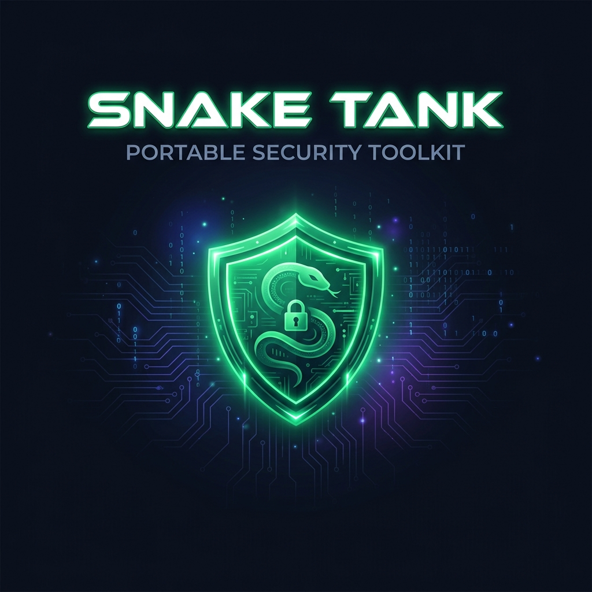
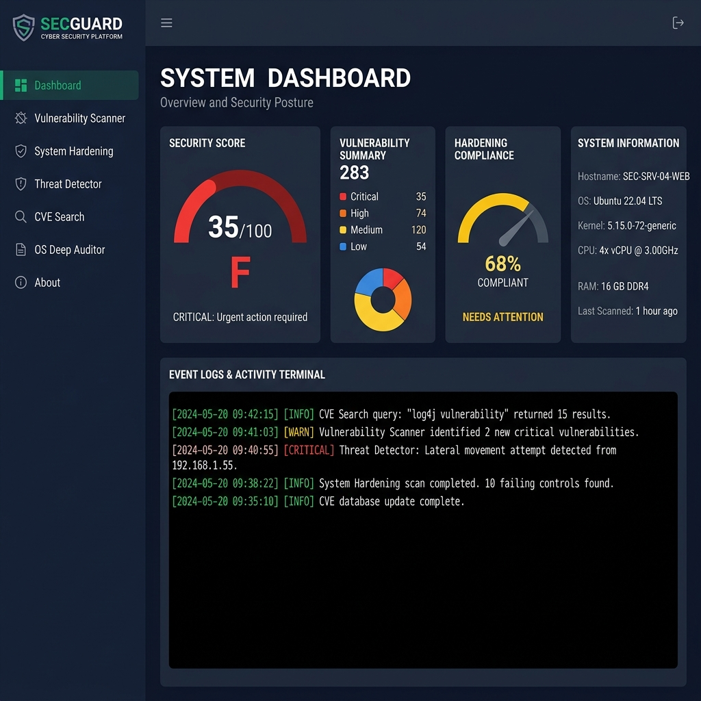

<p align="center">
  
</p>

<h1 align="center">🐍 Snake Tank Portable Security Toolkit</h1>

<p align="center">
  <strong>A zero-dependency, 100% portable Windows security auditing & hardening suite.</strong>
</p>

<p align="center">
  <a href="#-features"></a>
  <a href="#-quick-start"></a>
  <a href="#-license"></a>
</p>

<p align="center">
  
  
  
  
  
</p>

---

<p align="center">
  
</p>

---

## 📋 Table of Contents

- [About](#-about)
- [Features](#-features)
- [Quick Start](#-quick-start)
- [Architecture](#%EF%B8%8F-architecture)
- [Modules](#-modules-deep-dive)
- [System Requirements](#-system-requirements)
- [Project Structure](#-project-structure)
- [Testing](#-testing)
- [Contributing](#-contributing)
- [Disclaimer](#%EF%B8%8F-disclaimer)
- [License](#-license)

---

## 🐍 About

**Snake Tank Portable Security Toolkit** is a self-contained, zero-dependency Windows security auditing and hardening suite built entirely in native PowerShell with a modern WPF (Windows Presentation Foundation) GUI.

Designed for **penetration testers**, **blue team operators**, **sysadmins**, and **security enthusiasts** — simply copy the folder to a USB drive, plug into any Windows machine, and instantly audit, scan, and harden the host system. No installation. No internet. No excuses.

### Why Snake Tank?

| Traditional Tools | Snake Tank |
|:---|:---|
| ❌ Requires Python, .NET SDK, or npm | ✅ Zero dependencies — PowerShell only |
| ❌ Needs internet to install packages | ✅ 100% offline & air-gapped ready |
| ❌ Complex setup & configuration | ✅ Double-click `.bat` and go |
| ❌ CLI-only interface | ✅ Beautiful modern dark-theme GUI |
| ❌ Scattered tools for different tasks | ✅ All-in-one unified security suite |

---

## ✨ Features

<table>
<tr>
<td width="50%">

### 🛡️ Security Auditing
- 24-point comprehensive vulnerability scan
- CVSS severity scoring (Critical → Info)
- Real-time security score calculation
- Automated letter grade assessment (A-F)
- Hardening compliance percentage tracking

</td>
<td width="50%">

### 🔧 One-Click Hardening
- SMBv1 protocol deprecation
- Firewall profile enforcement
- Windows Defender activation
- RDP NLA enforcement
- Print Spooler & Remote Registry control
- Registry-level security policies

</td>
</tr>
<tr>
<td width="50%">

### 🔍 Threat Detection
- Windows Defender active threat scan
- Heuristic file analysis engine
- Startup persistence anomaly detection
- Suspicious script interpreter flagging
- Obfuscated payload pattern matching

</td>
<td width="50%">

### 🖥️ OS Deep Auditor
- 10-phase deep Windows OS inspection
- Hardware topology extraction (CPU, RAM, GPU)
- Active driver & service enumeration
- CVE/CVSS vulnerability cross-referencing
- OS Strength Score with live dashboard
- One-click OS hardening buttons

</td>
</tr>
<tr>
<td width="50%">

### 🌐 CVE Intelligence
- Real-time CVE search by keyword or ID
- Local software inventory audit
- Known vulnerability cross-referencing
- CVSS score tagging & severity mapping

</td>
<td width="50%">

### 📊 Reporting & Export
- Beautiful standalone HTML security reports
- Severity breakdown with visual charts
- Copyable manual remediation commands
- Real-time diagnostic log terminal

</td>
</tr>
</table>

---

## 🚀 Quick Start

### Option 1: Double-Click Launch (Recommended)

```
📁 Portable_Toolkit/
   └── 🖱️ Start_Snake_Tank.bat    ← Double-click this!
```

> The `.bat` launcher automatically requests Administrator elevation via UAC.

### Option 2: PowerShell Launch

```powershell
# Navigate to the toolkit directory
cd "C:\Path\To\Portable_Toolkit"

# Launch with execution policy bypass
powershell -NoProfile -ExecutionPolicy Bypass -File .\core\engine.ps1
```

### Option 3: Direct Tab Launch

```powershell
# Launch directly to Vulnerability Scanner
powershell -ExecutionPolicy Bypass -File .\core\engine.ps1 -Tab "Scanner"

# Launch directly to System Hardening
powershell -ExecutionPolicy Bypass -File .\core\engine.ps1 -Tab "Hardening"

# Launch directly to OS Deep Auditor
powershell -ExecutionPolicy Bypass -File .\core\engine.ps1 -Tab "OS"
```

### Shortcut Launchers

| Launcher | Description |
|:---|:---|
| `Start_Snake_Tank.bat` | Main dashboard launcher |
| `Snake_Tank_Scanner.bat` | Direct to vulnerability scanner |
| `Snake_Tank_Hardener.bat` | Direct to system hardening |

---

## 🏗️ Architecture

```
┌─────────────────────────────────────────────────────────────┐
│                    SNAKE TANK ENGINE                        │
│                                                             │
│  ┌──────────┐  ┌──────────────────────────────────────┐    │
│  │ SIDEBAR  │  │          CONTENT VIEWPORT             │    │
│  │          │  │                                        │    │
│  │ Dashboard│  │  ┌────────────────────────────────┐   │    │
│  │ Scanner  │  │  │    Active Module Page           │   │    │
│  │ Hardening│  │  │    (Dashboard / Scanner /       │   │    │
│  │ Threats  │  │  │     Hardening / Threats /       │   │    │
│  │ CVE      │  │  │     CVE / OS Auditor / About)   │   │    │
│  │ OS Audit │  │  │                                  │   │    │
│  │ About    │  │  └────────────────────────────────┘   │    │
│  │          │  │                                        │    │
│  │          │  │  ┌────────────────────────────────┐   │    │
│  │ v1.0.0   │  │  │  DIAGNOSTIC LOG TERMINAL       │   │    │
│  └──────────┘  │  └────────────────────────────────┘   │    │
│                └──────────────────────────────────────┘    │
└─────────────────────────────────────────────────────────────┘

Technology Stack:
  ├── PowerShell 5.1+ (Core Engine)
  ├── WPF / XAML (GUI Framework)
  ├── CIM / WMI (System Queries)
  ├── .NET Framework 4.x (Runtime)
  └── Win32 API (Registry / Services)
```

---

## 🔬 Modules Deep Dive

### 1️⃣ System Dashboard
> Real-time security posture overview

- **Security Audit Score** — Dynamic 0-100 score with letter grade badge
- **Vulnerability Breakdown** — Severity pill counts (Critical, High, Medium, Low)
- **Hardening Compliance** — Percentage of hardened subsystems
- **Host Configuration** — OS, CPU, RAM, GPU, Motherboard, Network details
- **Boot Security** — UEFI/Legacy, Secure Boot, Credential Guard (VBS)

### 2️⃣ Vulnerability Scanner
> 24-point automated security audit

| # | Check | Category |
|:--|:------|:---------|
| 1 | Windows OS Build Compliance | System |
| 2 | Legacy SMBv1 Protocol | Network |
| 3 | Firewall Profile Boundaries | Network |
| 4 | Windows Defender Real-Time | Defense |
| 5 | RDP Network Level Auth (NLA) | Access |
| 6 | Password Length Constraints | Identity |
| 7 | Guest Account Status | Identity |
| 8 | AlwaysInstallElevated Policy | Privilege |
| 9 | Unquoted Service Paths | Privilege |
| 10 | Startup Persistence Anomalies | Persistence |
| 11 | UAC Consent Prompting | Privilege |
| 12 | LLMNR Multicast Resolution | Network |
| 13 | LSA Credential Protection | Defense |
| 14 | RDP Default Port Exposure | Network |
| 15 | PowerShell Script Logging | Audit |
| 16 | WDigest Credential Caching | Defense |
| 17 | AutoPlay/AutoRun Restrictions | System |
| 18 | Remote Registry Service | Access |
| 19 | Local Admin Group Membership | Identity |
| 20 | BitLocker Drive Encryption | Defense |
| 21 | Exposed Listening Ports | Network |
| 22 | Third-Party AV/EDR Software | Defense |
| 23 | Anonymous SAM/SID Enumeration | Identity |
| 24 | Legacy TLS 1.0 & 1.1 Protocols | Network |

### 3️⃣ System Hardening Hub
> One-click remediation with rollback support

Each hardening rule includes:
- ✅ Human-readable vulnerability description
- ✅ Live status indicator (VULNERABLE / HARDENED)
- ✅ One-click "HARDEN NOW" button
- ✅ Copyable manual PowerShell/Registry command
- ✅ Real-time status validation after execution

### 4️⃣ Threat & Virus Detector
> Dual-engine threat hunting

- **Active Threat Scanner** — Queries Windows Defender for known active threats
- **Heuristic Hunter** — Scans common persistence folders for suspicious patterns:
  - Script interpreters in startup directories
  - Obfuscated PowerShell payloads (Base64, `-enc`, `-nop`)
  - Batch files in user Temp/AppData directories
  - Unsigned executables in startup paths

### 5️⃣ CVE Search & Software Audit
> Vulnerability intelligence engine

- Search CVEs by keyword, software name, or CVE ID
- Automated local software inventory extraction
- Cross-reference installed applications against known CVEs
- CVSS severity tagging with threat descriptions

### 6️⃣ OS Deep Auditor & Hardware Inspector
> 10-phase deep operating system inspection

| Phase | Audit Area | Details |
|:------|:-----------|:--------|
| 1 | OS Profile | Product name, build, architecture, boot mode, Secure Boot |
| 2 | Hardware | CPU topology, RAM, manufacturer, system model |
| 3 | Storage | Logical partitions, filesystem, capacity, usage % |
| 4 | Network | IPv4 adapters, interface aliases, connection status |
| 5 | Hotfixes | Latest KB security updates, patch compliance |
| 6 | Accounts | Local SAM accounts, enabled/disabled/lockout states |
| 7 | SMB Shares | Exposed non-default network shares |
| 8 | Drivers | Running kernel-mode system drivers |
| 9 | Services | Critical service states (Defender, Spooler, WinRM) |
| 10 | CVE Mapping | OS build → CISA KEV exploit cross-reference |

**OS Strength Score Dashboard:**
| Score | Grade | Status |
|:------|:------|:-------|
| 90-100 | 🟢 A | Highly Secured |
| 70-89 | 🟢 B | Hardened |
| 50-69 | 🟡 C | Attention Needed |
| 0-49 | 🔴 F | Vulnerable |

---

## 💻 System Requirements

| Requirement | Minimum | Recommended |
|:---|:---|:---|
| **Operating System** | Windows 10 (1809+) | Windows 11 (22H2+) |
| **PowerShell** | 5.1 | 5.1 (built-in) |
| **.NET Framework** | 4.7.2 | 4.8+ (built-in) |
| **RAM** | 512 MB free | 1 GB free |
| **Disk Space** | ~5 MB | ~5 MB |
| **Privileges** | Standard User* | Administrator |
| **Internet** | Not Required | Not Required |

> \* Standard user can run scans; Administrator required for hardening operations.

---

## 📁 Project Structure

```
Portable_Toolkit/
│
├── 🚀 Start_Snake_Tank.bat          # Main launcher (auto-elevates to Admin)
├── 🔍 Snake_Tank_Scanner.bat        # Direct launcher → Vulnerability Scanner
├── 🔧 Snake_Tank_Hardener.bat       # Direct launcher → System Hardening
│
├── core/
│   └── engine.ps1                   # Core PowerShell/WPF engine (all-in-one)
│
├── assets/
│   ├── banner.png                   # Repository banner image
│   ├── screenshot_dashboard.png     # Dashboard screenshot
│   ├── cybersecurity_dashboard.png  # Additional asset
│   └── system_hardening_shield.png  # Additional asset
│
├── test_harness.ps1                 # Automated test suite (5-step validation)
├── presentation.html                # Project presentation deck
└── README.md                        # You are here!
```

---

## 🧪 Testing

Snake Tank includes a comprehensive automated test harness:

```powershell
# Run the full test suite
powershell -ExecutionPolicy Bypass -File .\test_harness.ps1
```

**Test Coverage:**
| Step | Test | Validates |
|:-----|:-----|:----------|
| 1 | GUI Engine Load | XAML parsing, WPF window creation |
| 2 | Vulnerability Scanner | All 24 security audit checks |
| 3 | Hardening Validator | Status query for all hardening rules |
| 4 | Report Generator | HTML report compilation & file output |
| 5 | Threat & CVE Engine | Heuristic scanner, threat cards, CVE lookup |

---

## 🤝 Contributing

Contributions are welcome! Here's how to get involved:

1. **Fork** the repository
2. **Create** a feature branch (`git checkout -b feature/AmazingFeature`)
3. **Commit** your changes (`git commit -m 'Add AmazingFeature'`)
4. **Push** to the branch (`git push origin feature/AmazingFeature`)
5. **Open** a Pull Request

### Ideas for Contribution
- 🌐 Additional CVE database integrations
- 📊 PDF report export functionality
- 🔐 Active Directory auditing module
- 🌍 Multi-language support
- 📱 Remote scan agent capability

---

## ⚠️ Disclaimer

> **This tool is designed for authorized security auditing and educational purposes only.**
>
> Always obtain proper authorization before scanning or modifying any system you do not own. The developers assume no liability for misuse, damage, or unauthorized access resulting from the use of this toolkit.
>
> Use responsibly. Hack ethically. Stay legal.

---

## 📄 License

This project is licensed under the **MIT License** — see the [LICENSE](LICENSE) file for details.

---

<p align="center">
  <br />
  <strong>Built with 💚 by Snake Tank</strong>
  <br />
  <sub>Native PowerShell • Zero Dependencies • 100% Portable</sub>
  <br />
  <br />
  
</p>
